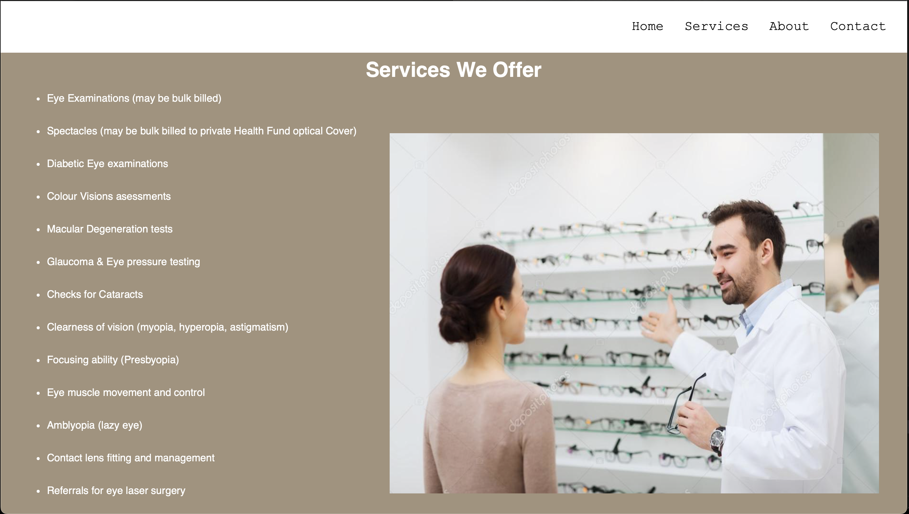
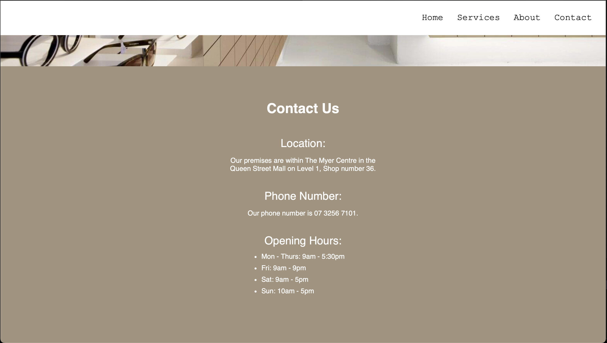

# Optical Website

A responsive, multi-section **optical services website** built using **HTML5** and **CSS3**. This static website showcases an optical business, detailing its services, contact information, and company background in a clean and accessible layout.

## Project Structure

```

optical-website/
├── index.html              # Main HTML file
├── css/
│   └── style.css           # Custom stylesheet
├── img/
│   └── services.jpg        # Image used in Services section

```

## Features

- **Navigation Bar**: Links to Home, Services, About, and Contact sections.
- **Services Section**: Extensive list of services provided including bulk-billed examinations and optical fittings.
- **About Section**: Overview of the company, highlighting child-focused care and professional optometrists.
- **Contact Section**: Includes location, phone number, and opening hours.
- **Responsive Design**: Mobile-friendly with scalable layout.
- **CSS Validation Badge**: Shows W3C-valid CSS compliance.

### Run Locally (with Live Server)

1. **Open your terminal** and navigate into the project folder:

   ```bash
   cd optical_website
   ```

   > Make sure you’re in the `optical_website` directory before launching Live Server.

2. Your site will open at `http://127.0.0.1:5500/optical-website/index.html#home`.

## Screenshots






## License

This project is licensed under the MIT License - see the [LICENSE](LICENSE) file for details.

---
